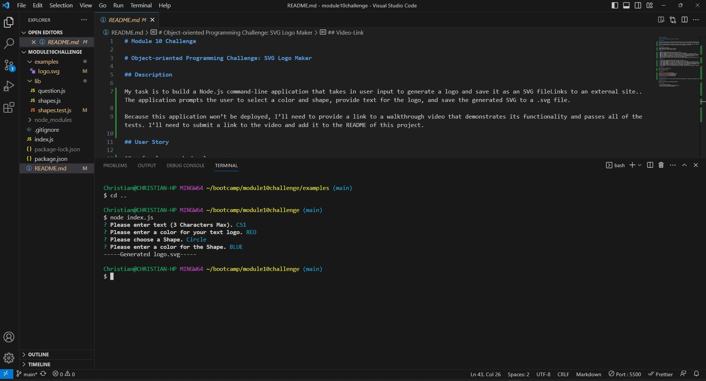
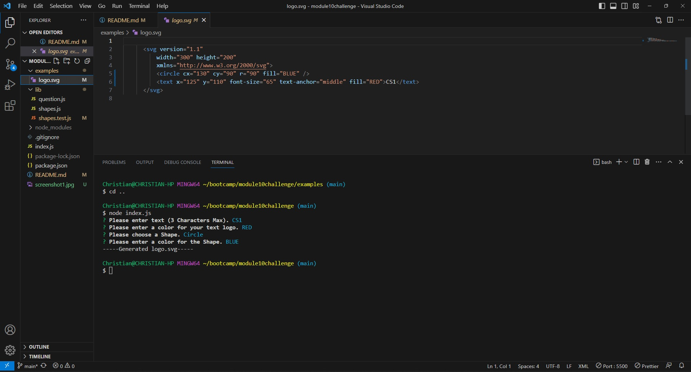

# Module 10 Challenge

# Object-oriented Programming Challenge: SVG Logo Maker

## Description

My task is to build a Node.js command-line application that takes in user input to generate a logo and save it as an SVG fileLinks to an external site.. The application prompts the user to select a color and shape, provide text for the logo, and save the generated SVG to a .svg file.

Because this application won’t be deployed, I’ll need to provide a link to a walkthrough video that demonstrates its functionality and passes all of the tests. I’ll need to submit a link to the video and add it to the README of this project.

## User Story

AS a freelance web developer
I WANT to generate a simple logo for my projects
SO THAT I don't have to pay a graphic designer

## Criteria

1. GIVEN a command-line application that accepts user input.
2. WHEN user prompted for text, then user can enter up to three characters.
3. WHEN user prompted for the text color, then user can enter a color keyword (OR a hexadecimal number).
4. WHEN user prompted for a shape, then user presented with a list of shapes to choose from: circle, triangle, and square.
5. WHEN user prompted for the shape's color, then user can enter a color keyword (OR a hexadecimal number).
6. WHEN user have entered input for all the prompts, then an SVG file is created named `logo.svg`.
7. AND the output text "Generated logo.svg" is printed in the command line
8. WHEN user open the `logo.svg` file in a browser, then user shown a 300x200 pixel image that matches the criteria user entered.
9. Run NPM RUN TEST and show all tests passing from the command line.

## Completed

1. I have created a command-line application that accepts user input.
2. I have created prompted for text, then user can enter up to three characters.
3. I have created prompted for the text color, then user can enter a color keyword (OR a hexadecimal number).
4. I have created prompted for a shape, then user presented with a list of shapes to choose from: circle, triangle, and square.
5. I have created prompted for the shape's color, then user can enter a color keyword (OR a hexadecimal number).
6. I have completed add function entered input for all the prompts, then an SVG file is created named `logo.svg`.
7. I have created an output text "Generated logo.svg" and printed in the command line
8. I have created a `logo.svg` file and user can open in a browser, then user shown a 300x200 pixel image that matches the criteria user entered.
9. I have created test and showing all tests passing from the command line.

## Video-Link

Video created with Screencastify.

Video Link demonstration: https://drive.google.com/file/d/1T2QQ_UPk08aFTQfjLqfuZS76253aCLOQ/view

## Screenshot

#### Run Test

#### Generating User Input

#### logo.svg on Visual Code Editor

#### logo.svg on Browser

## Generated logo.svg

A sample logo.svg file for a project repository generated using application is located inside "examples" folder. File name `logo.svg`.
link: https://github.com/csetiawan88/svglogomaker/tree/main/examples

## Repository-Link

GITHUB: https://github.com/csetiawan88/svglogomaker

## Technologies

- [Node.js](https://nodejs.org/)
- [Inquirer.js](https://www.npmjs.com/package/inquirer)
- [Jest](https://www.npmjs.com/package/jest)
